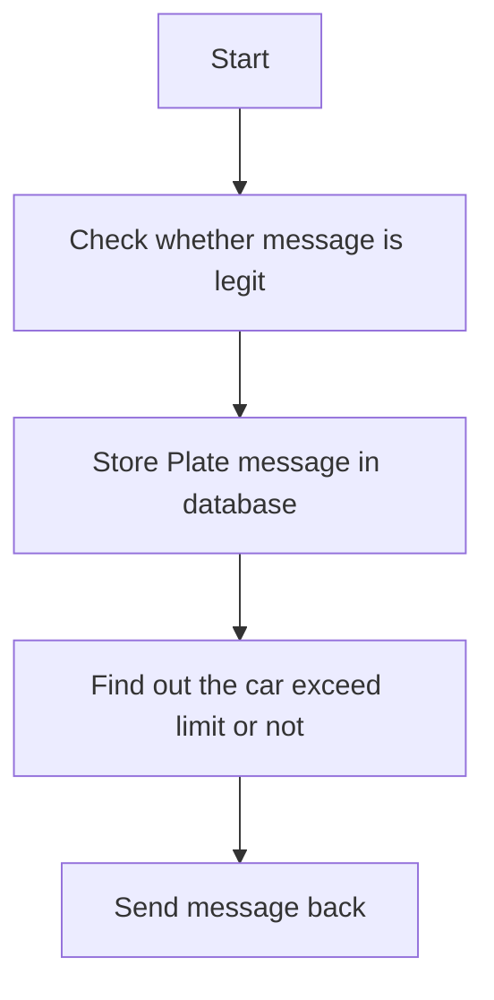

# ProtohackerElixir

solve [protohackers](https://protohackers.com/) problems:

- [x] Smoke test
- [x] Prime time
- [x] Means to an end
- [x] Budget chat
- [x] Unusual database program

## How to start program

### start project
```sh
mix run --no-halt
```

### start `smoke test` problem solution

```sh
mix smoke_test
```
program will be listening on port 10001

### start `prime time` problem solution
```sh
mix prime_time
```

program will be listening on port 10002

### start `measns to an end` problem solution

```sh
mix means_to_an_end
```

program will be listening on port 10003


### start `budget chat` problem solution

```sh
mix budget_chatr
```

program will be listening on port 10004

### start `unusual database program` problem solution

```sh
mix unusual_database_program
```

program will be listening on port 10005

### start `mob in the middle` problem solution

```sh
mix mob_in_the_middle
```

program will be listening on port 10006

`NOTE`: this problem solution has a tricky part. You need to replace not only client's message but also server's message.
I can get the point: not all o the messages come from your proxy client, but you have to guarantee that all messages are hacked, otherwise the you might lost your arm.

### Solution for problem 6

The key logic of your server is handling plate message

#### Handle plate message

####
